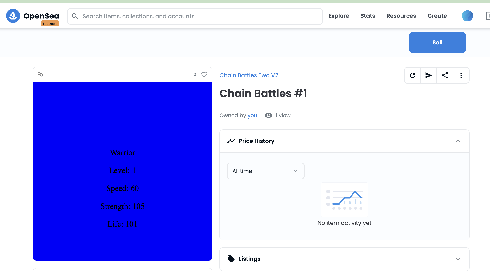

# road_to_web3_week3

- [x] How to store NFTs metadata on chain
- [x] What is Polygon and why it's important to lower Gas fees.
- [x] How to deploy on Polygon Mumbai
- [x] How to process and store on-chain SVG images and JSON objects
- [x] How to modify your metadata based on your interactions with the NFT
- [x] Finish challenge


## The Setup

First contract deployed to: 0xFbB69Fb33A74d9797903C4a02357bCe7c556A4e4


### Challenge:

Substitute the current tokenIdToLevels[] mapping with a struct that stores:
Level, Speed, Strength, Life

```
npx hardhat compile
```


```
npx hardhat run scripts/deployTwo.js --network mumbai
```

Contract deployed to: 0x77C8A0Ce8115832B5dbc9801D6e8803B04ba37b9


```
npx hardhat verify --network mumbai 0x77C8A0Ce8115832B5dbc9801D6e8803B04ba37b9
```

#### Successfully verified contract ChainBattlesTwo on Etherscan.


https://mumbai.polygonscan.com/address/0x77C8A0Ce8115832B5dbc9801D6e8803B04ba37b9#code


#### Successful NFT minted and trained:


https://testnets.opensea.io/assets/mumbai/0x77c8a0ce8115832b5dbc9801d6e8803b04ba37b9/1





